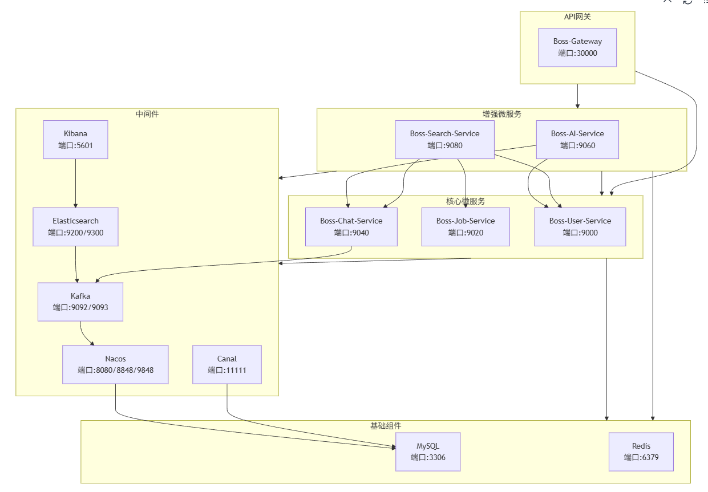

# Boss直聘Java岗招聘平台

## 项目简介

基于微服务架构的Java岗位招聘平台，支持HR发布职位、求职者申请、双向聊天和AI模拟面试功能。

## 服务架构

## 服务模块说明

### 1. boss-gateway (API网关)
- 端口: 30000
- 路由转发至各微服务
- 统一认证鉴权

### 2. boss-user-service (用户服务)
- 端口: 9000
- 功能: 用户注册、登录、信息管理
- 数据库: user_db

### 3. boss-job-service (职位服务)
- 端口: 9020
- 功能: 职位发布、管理、查询
- 数据库: job_db

### 4. boss-chat-service (聊天服务)
- 端口: 9040
- 功能: 实时聊天、WebSocket通信
- 数据库: chat_db
- 使用Kafka进行消息异步处理

### 5. boss-ai-service (AI服务)
- 端口: 9060
- 功能: AI模拟面试
- 集成Ollama AI模型

### 6. boss-search-service (搜索服务)
- 端口: 9080
- 功能: 基于Elasticsearch的全文搜索
- 使用Canal实现MySQL到Elasticsearch的数据同步

### 7. boss-common (公共模块)
- 存放公共实体类、工具类、常量定义等

## 第三方组件依赖

### 必需组件

#### 1. MySQL (多数据库)
项目使用多个MySQL数据库分别存储不同服务的数据:
- user_db: 用户数据
- job_db: 职位数据
- chat_db: 聊天记录数据

#### 2. Redis
用于缓存用户登录状态、会话信息等。

#### 3. Nacos
服务注册与发现，配置管理。

#### 4. Kafka
消息队列，用于异步处理聊天消息和AI面试请求。

#### 5. Elasticsearch
提供职位、申请记录和聊天记录的全文搜索功能。

#### 6. Canal
通过Canal监听MySQL的binlog日志，将用户、职位、聊天等数据的变更实时同步到Elasticsearch，从而提升搜索服务的数据实时性。

### 可选组件

#### Ollama
用于运行本地AI模型，为AI面试服务提供支持。

## 项目特点

1. **微服务架构**: 各服务独立部署，松耦合
2. **实时通信**: 支持WebSocket实现实时聊天
3. **异步处理**: 使用Kafka实现消息异步处理
4. **高性能搜索**: 基于Elasticsearch实现全文检索
5. **AI集成**: 提供AI模拟面试功能
6. **安全认证**: 基于Token的用户认证机制

## 部署说明

### 环境要求
- Java 21
- Maven 3.9+
- Docker (推荐)

### 启动顺序
1. 启动基础组件: MySQL, Redis, Nacos, Kafka, Elasticsearch, Canal
2. 启动第一组微服务: user-service, job-service, chat-service
3. 启动第二组微服务: ai-service, search-service
4. 最后启动API网关: boss-gateway

### Docker部署
项目提供了Dockerfile，支持容器化部署。

## 开发规范

1. 所有接口均通过API网关访问
2. 服务间调用使用Feign Client
3. 统一返回格式: Result<T>
4. 使用Redis缓存用户会话信息
5. 敏感操作需进行身份验证