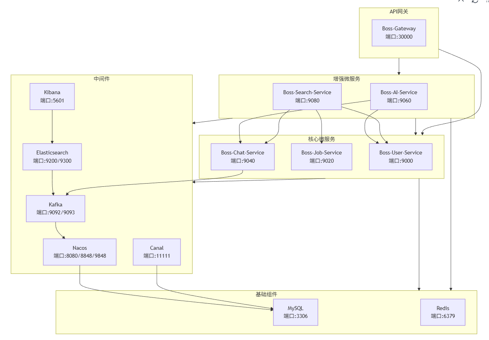

# Boss直聘Java岗招聘平台

## 项目简介

基于微服务架构的Java岗位招聘平台，支持HR发布职位、求职者申请、双向聊天和AI模拟面试功能。

## 服务架构

## 服务模块说明

### 1. boss-gateway (API网关)
- 参考端口: 30000
- 路由转发至各微服务
- 统一认证鉴权

### 2. boss-user-service (用户服务)
- 参考端口: 9000
- 功能: 用户注册、登录、信息管理
- 数据库: user_db

### 3. boss-job-service (职位服务)
- 参考端口: 9020
- 功能: 职位发布、管理、查询
- 数据库: job_db

### 4. boss-chat-service (聊天服务)
- 参考端口: 9040
- 功能: 实时聊天、WebSocket通信
- 数据库: chat_db
- 使用Kafka进行消息异步处理

### 5. boss-ai-service (AI服务)
- 参考端口: 9060
- 功能: AI模拟面试
- 集成Ollama AI模型

### 6. boss-search-service (搜索服务)
- 参考端口: 9080
- 功能: 基于Elasticsearch的全文搜索
- 使用Canal实现MySQL到Elasticsearch的数据同步

### 7. boss-common (公共模块)
- 存放公共实体类、工具类、常量定义等

## 部署说明

### 环境要求
- Java 21
- Maven 3.9+
- Docker (推荐)

### 启动顺序
1. 启动基础组件: MySQL, Redis, Nacos, Kafka, Elasticsearch, Canal
2. 启动第一组微服务: user-service, job-service, chat-service
3. 启动第二组微服务: ai-service, search-service
4. 最后启动API网关: boss-gateway
